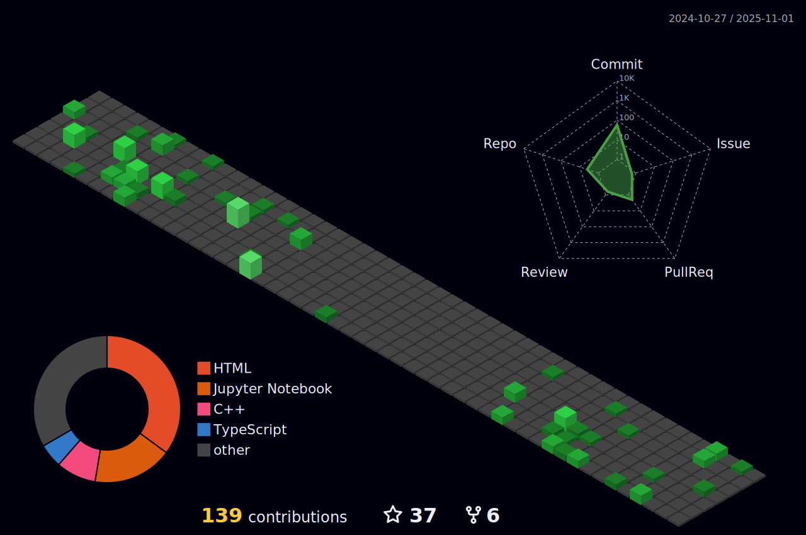

   <h1>Hi there, I'm <a href="https://github.com/eshansurendra">Eshan</a>  </h1>

<h3> 🙎 Eshan Surendra | 🛸 Sri Lanka </h3>

<!--
**eshansurendra/eshansurendra** is a ✨ _special_ ✨ repository because its `README.md` (this file) appears on your GitHub profile1.

Here are some ideas to get you started:

- 🔭 I’m currently working on ...
- 🌱 I’m currently learning ...
- 👯 I’m looking to collaborate on ...
- 🤔 I’m looking for help with ...-->

- 🎓 Electronic & Telecommunication Engineering Undergraduate Student at [University of Moratuwa](https://www.mrt.ac.lk/eng/)
- 🚀 I'm enthusiastic about AI and ML!
- 🔧 Currently working on FYP: Estimation of ECM Signatures in 
Fiber Probe Images.
<!--
- 💬 Ask me about **Python, Tensorflow**
-->

  <h3>📫 How to reach me:</h3>
  

    
    &nbsp;&nbsp;
    
    &nbsp;&nbsp;
    
  

  
<!--
- 😄 Pronouns: ...
- ⚡ Fun fact: ...
-->

<h3 align="left">Languages and Tools:</h3>

   
   
   
   
   
  
  
   

   

<!-- 

  

     
    
    
  

 -->

  

    
    
    <!--  -->
  

